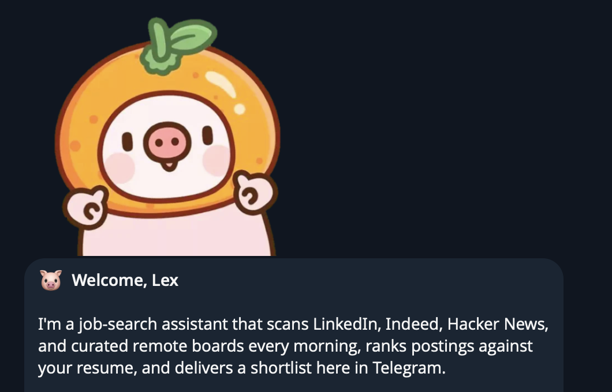
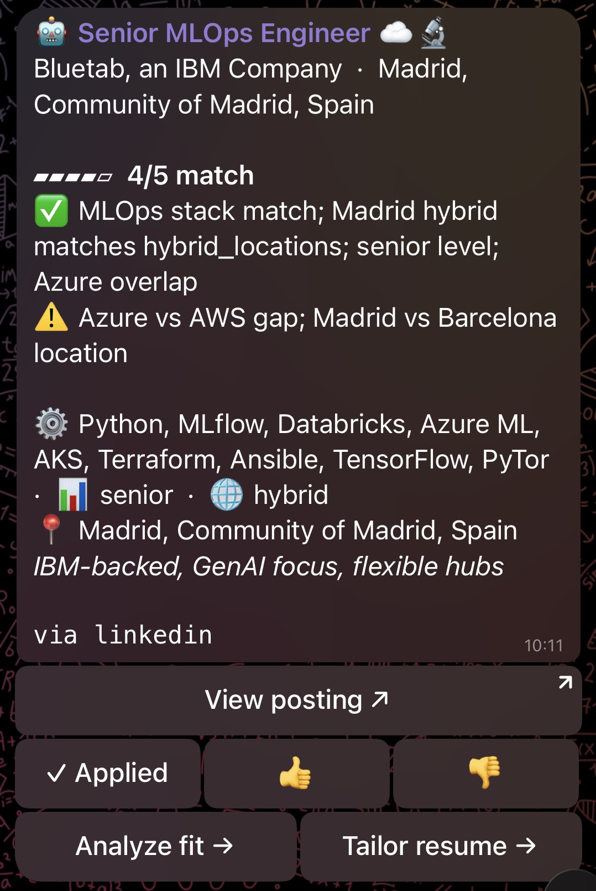
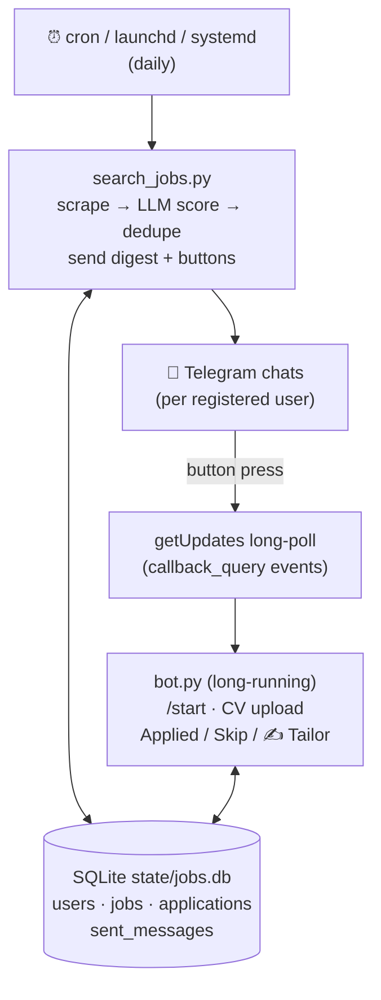

<div align="center">



# Oink — AI Job Search in Telegram

**Oink scrapes 25+ sources, scores every posting against your resume with Claude, and pushes only the real matches to your Telegram — each with a hiring contact and one-tap tracking.**

[](https://t.me/job_search_everyday_bot)
[](#setup-self-hosting)
[](https://docs.claude.com/claude-code)
[](#the-scrapers-as-an-api)
[](LICENSE.md)

[**Try the live bot**](https://t.me/job_search_everyday_bot) ·
[Quick start](#quick-start) ·
[How it works](#how-it-works) ·
[Self-host](#setup-self-hosting) ·
[API access](#the-scrapers-as-an-api)

</div>

---

## Try it first

1. Open [**@job_search_everyday_bot**](https://t.me/job_search_everyday_bot)
2. Send `/start` and upload your CV (PDF)
3. Matching jobs will start arriving

Every card looks like this:

<div align="center">

</div>

## Ways to use this

| Path | You get | Cost |
|------|---------|------|
| 🐷 [**Hosted bot**](https://t.me/job_search_everyday_bot) *(recommend to try)* | `/start` in Telegram, upload CV, done — zero setup, sources maintained for you | Free to try |
| 🏢 [**oinkjobsearch.com**](https://oinkjobsearch.com) | A managed private instance: uptime, upgrades, and support handled for you | Free to try |
| 🔌 [**Apify actors**](#the-scrapers-as-an-api) | The scrapers behind this bot as clean JSON APIs — proxies and anti-bot handled | Pay per result, from ~1$ per month + your Claude subscription |
| 🛠️ **Self-host this repo** | Full control: your keys, your data, your prompts — see [Setup](#setup-self-hosting) | Free, only your Claude subscription |

## How it works

1. **Scrapes 25+ sources** — LinkedIn, HN "Who is Hiring", Wellfound, EURES,
   ReliefWeb, remote boards, EU tech boards, academic/research boards
   (full list in `skill/job-search/scripts/sources/`).
2. **Builds your profile with Claude** — from your uploaded resume plus
   free-text preferences (`/prefs`), rebuilt by Opus on demand.
3. **Scores every posting with an LLM** — no keyword filters; a scoring
   prompt weighs each job against your profile, and only matches above your
   `/minscore` threshold ship.
4. **Delivers each match as a Telegram card** — with a hiring contact and
   inline buttons to track applications or generate a tailored resume note.
5. **Runs deep market research on request** — `/marketresearch` fans out
   10 Opus agents and returns a polished `.docx` report on demand, salaries,
   and trends for your role + location.
6. **Remembers everything** — applied/skipped roles never reappear; history
   lives in a local SQLite DB you own.

## Who it's for

| You are | Your sources |
|---------|-------------|
| **Software engineer** (frontend, backend, full-stack, DevOps/SRE) | LinkedIn, HN "Who is Hiring", Welcome to the Jungle, Built In, Wellfound (startups/YC), EU tech boards (JustJoin.it, NoFluffJobs, Tecnoempleo, InfoJobs) |
| **ML / AI engineer, data scientist** | aijobs.net (curated AI/ML/MLOps board) on top of all general tech sources |
| **Researcher / academic** (PhD, postdoc, faculty) | EURAXESS, jobs.ac.uk, AcademicPositions, Ikerbasque, university doctoral boards |
| **Humanitarian / international development** | ReliefWeb, ImpactPool, DevEx, UN/INGO portals |
| **Remote-first, any of the above** | Dedicated remote boards plus EU-wide vacancies via EURES |

**Not for**: recruiters sourcing candidates, bulk scraping, or hosting a
public multi-tenant service — the scrapers are deliberately low-volume and
some sources' TOS restrict use to personal job search.

## Quick start

```bash
git clone https://github.com/Exdenta/OinkAIJobSearch.git && cd OinkAIJobSearch && claude
```

Then type **`/setup`**. [Claude Code](https://docs.claude.com/claude-code)
walks you through the rest — dependencies, a free Telegram bot token from
@BotFather, `.env`, scheduling — and smoke-tests your bot at the end.
No Claude Code? Follow the manual [Setup](#setup-self-hosting) below.

### What you need

- **Python 3.10+** and the deps in `requirements.txt`
- **A Telegram bot token** — free, from [@BotFather](https://t.me/BotFather)
- **Claude Code CLI** — the `claude` binary on PATH, authenticated (a Claude
  subscription is enough; no API key required). All AI steps — scoring,
  profile builds, hiring-contact lookup, market research — run through
  `claude -p`. Without it the bot still scrapes but can't score or
  personalize.

## Setup (self-hosting)

**1. Install dependencies**

```bash
python3 -m venv .venv && .venv/bin/pip install -r requirements.txt
# or: pip install --break-system-packages -r requirements.txt
```

**2. Put your bot token in `.env`**

```bash
TELEGRAM_BOT_TOKEN=123456789:AAE-your-bot-token-here
```

No `TELEGRAM_CHAT_ID` needed — users register themselves via `/start`.
Optional: set `APIFY_TOKEN` to unblock AcademicPositions via the
[Apify actors](#the-scrapers-as-an-api).

**3. Start the bot** (long-running process)

```bash
python skill/job-search/scripts/bot.py
```

Leave this running — it handles `/start`, resume uploads, and button
presses. For production, wrap it in systemd / nohup / Docker:

```bash
nohup python skill/job-search/scripts/bot.py > bot.log 2>&1 &
```

**4. Onboard yourself** — in Telegram, send `/start` to your bot and upload
your CV (PDF). The bot saves it to `state/users/<chat_id>/resume.pdf`,
extracts text, and you're in.

**5. Smoke-test the digest**

```bash
python skill/job-search/scripts/search_jobs.py --dry-run
```

Prints what would be posted without sending or recording anything.

**6. Schedule searches** — two modes, pick one:

<details>
<summary><b>Continuous mode (recommended)</b> — <code>bot.py</code> runs the search loop itself</summary>
<br>

`bot.py` runs the search loop every couple of hours for a single chat.
Quality is gated by the per-user buffer (P1) and pagination by the
source-page cursors (P2), so the loop never re-fetches the same source page
within 6h and only flushes ≥4-scored matches. Enable with two env vars:

```bash
export OINK_CONTINUOUS_MODE=1
export OINK_CONTINUOUS_CHAT_ID=433775883     # your Telegram chat_id
python skill/job-search/scripts/bot.py
```

With these set, remove any cron entry first (`crontab -e`) — otherwise the
same search runs twice. The interval is tunable in `defaults.py`
(`continuous_interval_seconds`, default 7200).

Continuous mode is single-user — only `OINK_CONTINUOUS_CHAT_ID` is driven
by the in-process loop. Other users still use on-demand `/jobs` taps.

</details>

<details>
<summary><b>Cron mode (legacy)</b> — point any scheduler at <code>search_jobs.py</code></summary>
<br>

```cron
0 8 * * *  cd /path/to/FindJobs && /usr/bin/python3 skill/job-search/scripts/search_jobs.py >> bot.log 2>&1
```

**launchd** (macOS): drop a `.plist` in `~/Library/LaunchAgents/` that runs
`python skill/job-search/scripts/search_jobs.py` on a
`StartCalendarInterval`.

**systemd timer** (Linux): pair a `findjobs.service`
(`ExecStart=python skill/job-search/scripts/search_jobs.py`) with a
`findjobs.timer` (`OnCalendar=*-*-* 08:00:00`).

The long-running `bot.py` process is separate from the cron-fired digest —
keep it up so `/start`, uploads, and button presses keep working between
digests.

</details>

## Bot commands

| Command | Action |
|---------|--------|
| `/start` | Onboarding wizard + register your chat_id |
| `/help` | Full command reference |
| `/jobs` | Run a search now, don't wait for the daily digest |
| `/prefs` | Send/update free-text preferences (triggers an Opus profile rebuild) |
| `/clearprefs` | Wipe stored free-text preferences |
| `/minscore` | Set the minimum match-score filter |
| `/myprofile` | Show the current AI-built profile summary |
| `/rebuildprofile` | Force-rebuild the profile from resume + free-text |
| `/applied` | List every role you've marked applied |
| `/marketresearch` | Deep market scan for your role + location — delivered as a `.docx` report (~25–40 min) |
| `/cleardata` | Scoped deletion menu (resume / history / tailored / profile / research / everything) |
| `/privacy` | In-chat privacy summary + link to the full policy |

**Button behavior:** ✅ Applied records the application — the job never
reappears. 🚫 Not applied hides it (tracked separately so you can audit).
✍️ Tailor my resume compares your resume's skills against the posting and
sends back a Markdown note as a file attachment — it only rearranges
emphasis, it never invents experience.

## Architecture



Per-user files live under `state/users/<chat_id>/` — `resume.pdf`,
`resume.txt`, `tailored/<job_id>.md`, `research/`.

<details>
<summary><b>Directory layout</b></summary>

```
FindJobs/
├── README.md
├── requirements.txt
├── .env                      ← TELEGRAM_BOT_TOKEN, OPERATOR_CONTACT,
│                                APIFY_TOKEN (optional) (gitignored)
├── .env.example
├── deploy/                   ← systemd units, Caddy config, VPS bootstrap scripts
├── docs/
│   ├── PRIVACY.md            ← privacy policy published with the bot
│   ├── per-user-profile-plan.md
│   └── telegram_listing.md
├── state/                    ← runtime data (gitignored)
│   ├── jobs.db               ← SQLite — auto-created
│   └── users/<chat_id>/      ← per-user resumes, tailored notes, research
├── tools/
│   ├── get_chat_id.py        ← helper (mostly obsolete now; use /start)
│   ├── demo_ui_to_user.py    ← one-shot UI demo sender
│   ├── capture_sticker_ids.py
│   └── fetch_fat_roll_pig.py
└── skill/
    └── job-search/
        ├── SKILL.md          ← skill definition Claude reads
        ├── scripts/
        │   ├── search_jobs.py         ← scheduled digest orchestrator
        │   ├── bot.py                 ← long-running Telegram bot
        │   ├── onboarding.py          ← /start wizard + resume intake
        │   ├── db.py                  ← SQLite layer
        │   ├── dedupe.py              ← Job dataclass + per-user dedupe
        │   ├── telegram_client.py
        │   ├── resume_tailor.py       ← skill-matching + markdown note
        │   ├── fit_analyzer.py        ← per-job fit scoring
        │   ├── pig_stickers.py        ← sticker cache + sender
        │   ├── profile_builder.py     ← Opus profile rebuild
        │   ├── market_research.py     ← /marketresearch orchestrator (10 Opus workers + manager)
        │   ├── market_research_render.py  ← DOCX renderer for ResearchRun
        │   ├── safety_check.py        ← prompt-injection gate for user input
        │   ├── prompts/               ← fit_analysis.txt, market_research_*.txt, profile_builder.txt
        │   ├── sources/               ← 25+ adapters, one file per board
        │   └── tools/
        │       └── reset_user.py      ← per-user history wipe
        └── references/
            └── source_notes.md
```

</details>

<details>
<summary><b>Hiring-contact lookup — how the 👤 line works</b></summary>
<br>

For every card about to ship, a Claude agent (WebSearch + WebFetch,
`hiring_contact.py`) hunts for the one person who most plausibly owns the
opening: the recruiter named on the posting, the talent-acquisition partner
covering that function and region, the hiring manager, or a founder at a
tiny startup. The name links to their public profile (LinkedIn `/in/…`
preferred) and the italic line says why this person was picked.

Verdicts are cached per posting in the `hiring_contacts` table, lookups run
only for jobs that survived every send gate, and any failure just ships the
card without the block.

Knobs: `HIRING_CONTACT_OFF=1` disables the pass; `HIRING_CONTACT_TIMEOUT_S`
(default 180), `HIRING_CONTACT_WORKERS` (default 3),
`HIRING_CONTACT_MODEL` (default sonnet) tune it.

</details>

<details>
<summary><b>/marketresearch — deep market research pipeline</b></summary>
<br>

Requires: resume uploaded + profile built (`/prefs`).

The bot asks for a target location (send `.` to reuse the location from
your profile, or type a market like `Berlin, Germany` / `Remote EU`). A
per-user lock ensures only one run at a time. Behind the scenes:

1. **10 Opus sub-agents run in parallel**, each with WebSearch + WebFetch
   and a narrow topic: current demand & volume · 24-month historical
   context · industry trends · your resume skills vs. the market ·
   12–18-month projections · salary in your home market · salary in
   neighboring markets · company landscape · interview & hiring bar ·
   recommended upskilling plan.
2. **A manager agent synthesizes** the ten JSON outputs, dedups sources,
   and renumbers citations globally.
3. **`market_research_render.py` renders a polished `.docx`** — cover page,
   auto-populating Word TOC, numbered references, clickable URLs, skill +
   salary tables.
4. The bot sends the DOCX plus a short Telegram summary. Each run is logged
   to `research_runs` with status / elapsed_ms / worker counts / input
   hashes / docx path.

Failure policy: ≥5 worker failures → report aborted; 1–4 → partial report
with a notice listing failed topics; manager crash on an otherwise OK run
demotes it to partial. Saved runs live under
`state/users/<chat_id>/research/` and are wiped by `/cleardata → 🔬 Research`.

Prompt-injection hardening: every sub-agent prompt wraps the candidate's
inputs in opaque-data blocks with an instruction-ignore preamble; the
user's location input passes through the same
`safety_check.check_user_input` gate as `/prefs` before it reaches any
Claude call.

</details>

<details>
<summary><b>Data model (SQLite)</b></summary>
<br>

- **users** — chat_id, resume_path, resume_text, prefs_free_text (raw
  `/prefs` input), user_profile (Opus-built JSON profile)
- **jobs** — every posting ever seen (stable job_id = sha1 of source+url)
- **applications** — (chat_id, job_id) → status ∈ {applied, skipped, interested}
- **sent_messages** — (chat_id, message_id) → job_id, so callbacks can resolve
- **profile_builds** — audit log (status, error, elapsed_ms, input hashes)
  for every Opus profile build
- **research_runs** — audit log (status, elapsed_ms, workers_ok/failed,
  docx_path, input hashes) for every `/marketresearch` run
- **hiring_contacts** — per-job cache of "who to write to" lookups
  (status ∈ {found, not_found} + the contact dict); transport errors are
  never cached so they retry on the next send

Deletion: to reset a user, `DELETE FROM users WHERE chat_id=?` and drop
their `state/users/<chat_id>/` folder. To wipe job history, delete
`state/jobs.db`.

</details>

## Extending

- **Add a source**: drop `my_source.py` into
  `skill/job-search/scripts/sources/`, expose `fetch(filters) -> list[Job]`,
  register in `search_jobs.py:SOURCES`, add a toggle in
  `defaults.py:DEFAULTS["sources"]`.
- **Change button behavior**: edit `telegram_client.py::job_keyboard` and
  the callback dispatcher in `bot.py::handle_callback`.
- **Upgrade resume tailoring to a full LLM rewrite**: replace
  `resume_tailor.py::build_tailor_note` with an API call.

## The scrapers, as an API

Every scraper behind Oink is also published as a standalone **Apify
actor** — call any source as a clean JSON API from your own pipeline, no
bot required. These are the same actors this bot runs on in production
every day, and they handle the hard stuff: residential proxies,
DataDome/Cloudflare bypass, pagination, dedupe, and delta mode so you pay
only for postings you haven't seen. No subscription — pay per result.

| Actor | What it does |
|-------|--------------|
| [**linkedin-scraper**](https://apify.com/nomad-agent/linkedin-scraper) | LinkedIn Jobs without login — delta mode for scheduled alerts, $0.90/1k results |
| [**all-jobs-scraper**](https://apify.com/nomad-agent/all-jobs-scraper) | 19 job boards behind one endpoint — the whole fleet in a single call, from $1.20/1k |
| [**ai-job-search-agent**](https://apify.com/nomad-agent/ai-job-search-agent) | Full AI job search as an API — describe the candidate, get scored matches. AI cost included |
| [**company-careers-bundle**](https://apify.com/nomad-agent/company-careers-bundle) | Turn a company list into live postings via Greenhouse, Lever, Ashby, Workable, SmartRecruiters, Workday |
| [**europe-jobs-bundle**](https://apify.com/nomad-agent/europe-jobs-bundle) | 14 Europe-focused sources (EURES, EURAXESS, WTTJ, JustJoin.it, NoFluffJobs, InfoJobs, Tecnoempleo, jobs.ac.uk…) |
| [**researcher-bundle**](https://apify.com/nomad-agent/researcher-bundle) | 12-source academic/research aggregator (EURAXESS, jobs.ac.uk, EURES, AcademicPositions, ReliefWeb…) |
| [**remote-boards-scraper**](https://apify.com/nomad-agent/remote-boards-scraper) | RemoteOK, Remotive, WeWorkRemotely, Himalayas in one run |
| [**eures-scraper**](https://apify.com/nomad-agent/eures-scraper) | EURES — 2M+ live EU vacancies across 31 countries, official EU job-mobility portal |
| [**euraxess-scraper**](https://apify.com/nomad-agent/euraxess-scraper) | EURAXESS — the EU's official researcher-mobility portal: PhD, postdoc, fellowship, faculty |
| [**jobs-ac-uk-scraper**](https://apify.com/nomad-agent/jobs-ac-uk-scraper) | jobs.ac.uk — UK academic, postdoc and research jobs |
| [**academicpositions-scraper**](https://apify.com/nomad-agent/academicpositions-scraper) | Postdoc, PhD and faculty jobs from academicpositions.com across EU, UK, Switzerland |
| [**impactpool-scraper**](https://apify.com/nomad-agent/impactpool-scraper) | Impactpool.org — UN, NGO and international-development careers |
| [**unjobs-scraper**](https://apify.com/nomad-agent/unjobs-scraper) | unjobs.org — UN and NGO vacancies across 143 agencies (UNICEF, WFP, UNDP, UNHCR…) |
| [**ycombinator-was-scraper**](https://apify.com/nomad-agent/ycombinator-was-scraper) | Y Combinator's Work at a Startup board — 1,000+ jobs with parsed salary, equity, visa policy |

For several of these sources (EURAXESS, EURES, Impactpool, unjobs.org,
jobs.ac.uk, AcademicPositions) these are the **only maintained scrapers on
Apify**. Full catalog — 50+ actors covering jobs, search, app intelligence
and open data: [apify.com/nomad-agent](https://apify.com/nomad-agent).

<!-- TODO: append Apify fair-share affiliate parameter (e.g. ?fpr=<code>) to the links above once assigned -->

> [!NOTE]
> AcademicPositions is blocked in the self-hosted scraper (Cloudflare — see
> `skill/job-search/references/source_notes.md`); set `APIFY_TOKEN` in
> `.env` and it's pulled through the actor above instead. That's also the
> easiest way to support this project: source fetches through the actors
> are what fund its maintenance.

## Security notes

- `.env` contains your bot token — gitignored, don't commit it.
- LinkedIn and Indeed adapters scrape public search endpoints; both
  services disallow automated access in their TOS. Use low volume and
  accept the risk. Read `skill/job-search/references/source_notes.md`.
- Resume PDFs live on disk in `state/users/<chat_id>/resume.pdf`. If
  multiple people use this instance, secure the filesystem accordingly.
- If the bot token leaks: [@BotFather](https://t.me/BotFather) → `/revoke`,
  paste the new token into `.env`, restart `bot.py`.

## License

[PolyForm Noncommercial 1.0.0](LICENSE.md) — free to use, modify, and share
for any noncommercial purpose (personal job search, research, education,
nonprofits). Commercial use is not permitted.

Required Notice: Copyright Lex Sherman

---

<div align="center">

**Found a match through Oink?** ⭐ this repo —
or [try the live bot](https://t.me/job_search_everyday_bot) and tell a friend.

</div>
